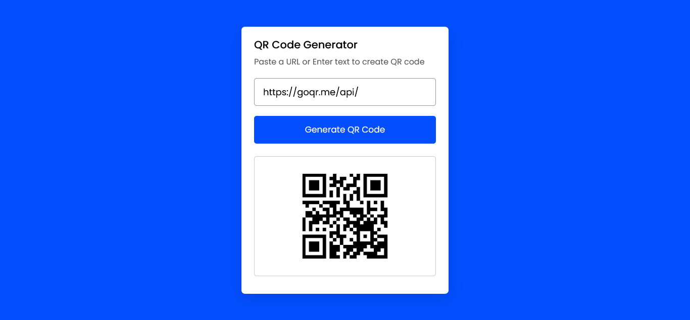

# QR Code Generator


QR Code Generator website is used to generate qr code images for the given URL address. It was created using HTML5, CSS3, JavaScript and qrserver API.

## Installation

**STEP 1 :** Clone the repository using `git`
```
git clone https://github.com/Prakashdeveloper03/QR-Code-Generator.git
```

**STEP 2 :** For more details about API visit the [qrserver API](https://goqr.me/api/) website.

**STEP 3 :** Run the below command to open `index.html` file in your default browser
```
QR-Code-Generator/index.html
```

## 📷 Screenshots
